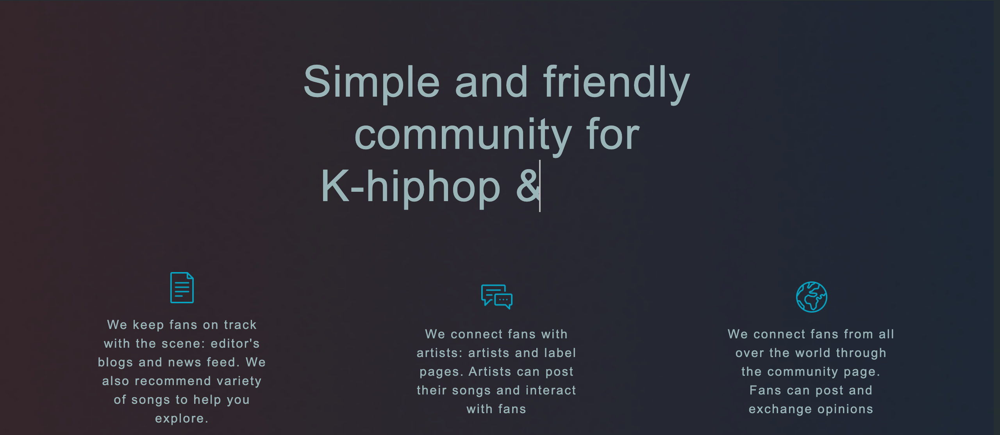
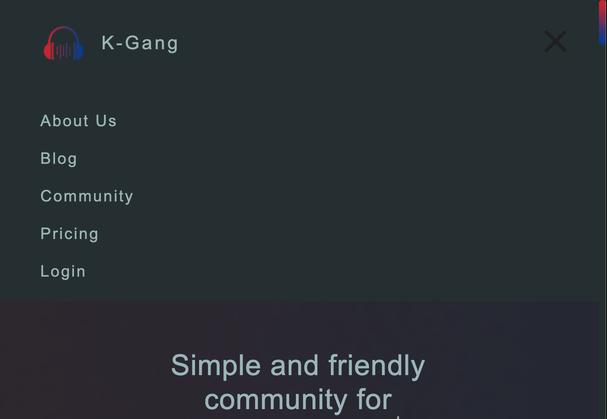
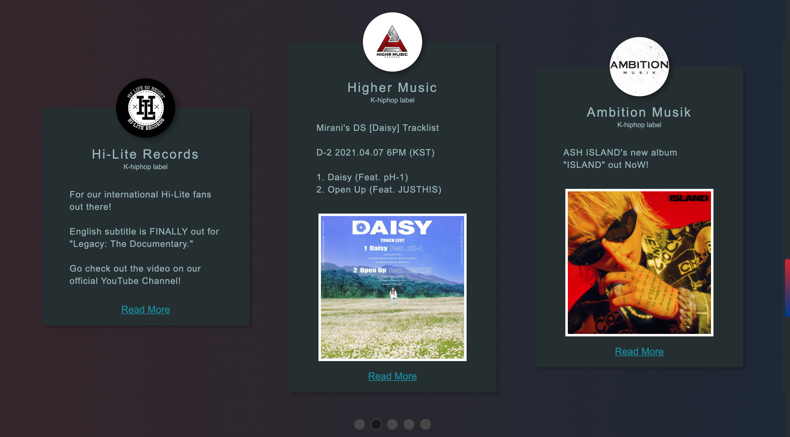
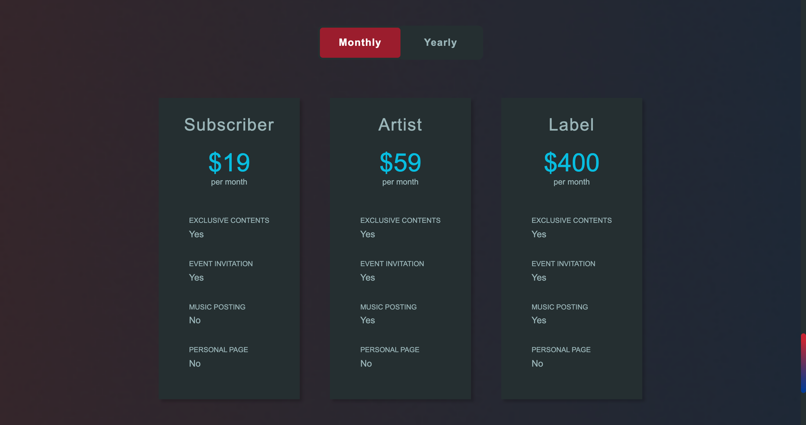
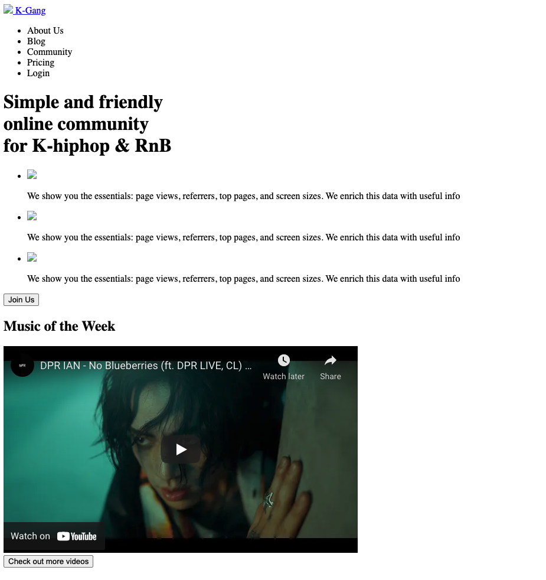
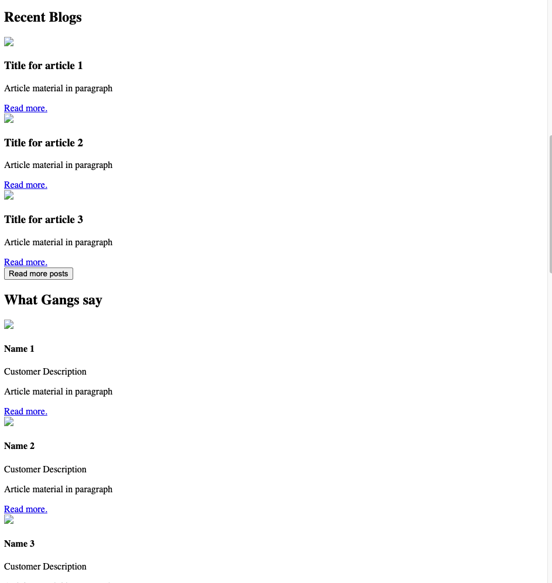
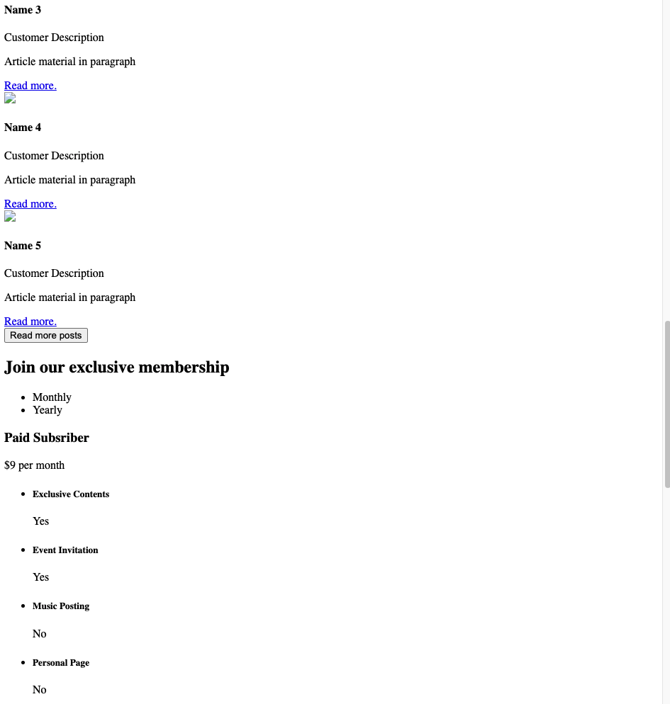
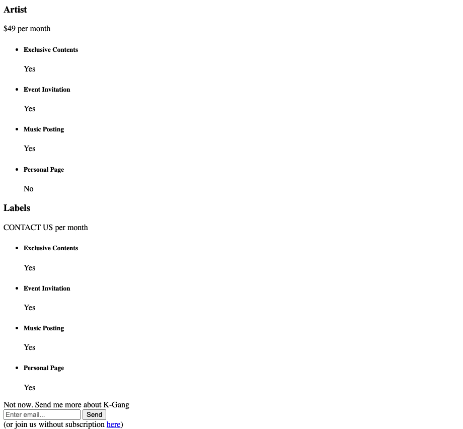
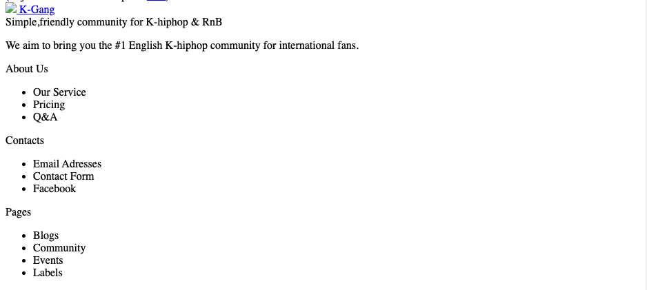

# Lab 1: K-Gang

*For the lab, I created a community and blog page for korean hiphop and rnb page by following the structure of https://simpleanalytics.com*

[deployed url](http://url-if-deployed-here)

## What Worked Well

I was able to duplicate the structure of the original webpage: [original web](https://simpleanalytics.com). Then , I was able to style the structure so that it would look similar to the original page. I utilized flexboxes effectively to make responsive website. In addition, I was able to utilize the checkbox/radio button hacks to create simple slider and tab functionalities.  

* credits for referenced resources from webpages such as Stack Overflow are written inside the code as comments. 

## What Didn't
Since we were not allowed to use JS, I had a hard time replicating the functionality of the webpage. For example, I was not able to replicate the multi-image carousel from the original webpage; however, I was able to implement a similar functionality, which is shown in Extra Credit. Also, it was hard to work with the responsiveness, especially the narrow screen of a mobile web. 

## Extra Credit
I assumed that "checkbox hacks" related stuff would count as extra credit

1) Typewriter

2) Mobile Menu (Hamburger):

3) Checkbox Hack- Post sliders similar to carousel: I used radiobuttons and transform to create these effects

4) Checkbox Hack- payment tabs:

 

## Screenshots
###Screenshots of HTML Version

